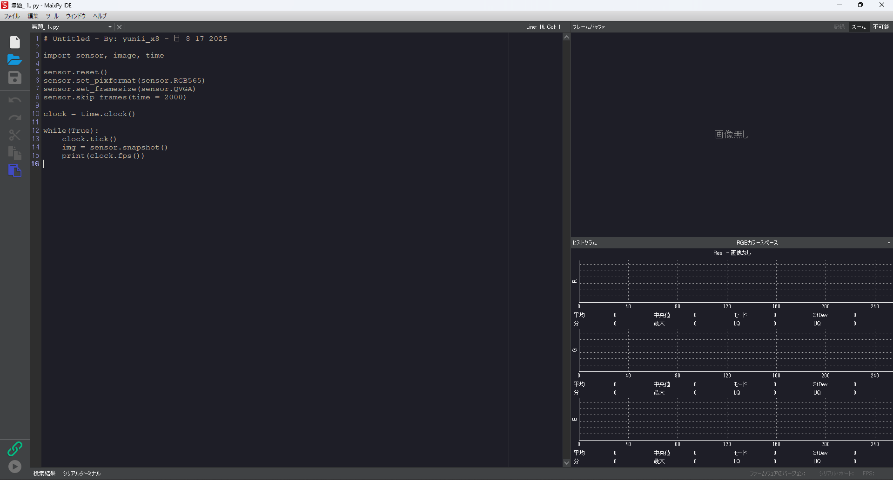

# Thonnyのインストール
以下のリンクを開いてください。

https://thonny.org/

Download version x.x.x の下のWindows・Mac・Linuxから自分のパソコンにあったものを開きます。  

WindowsならexeMacならpkgをダウンロードしてインストールします。

このような画面が開けば成功です。(バージョンによりUIや手順が変更になる可能性があります)

# Sipeed MaixPiのインストール

以下のリンクを開きます。

https://dl.sipeed.com/shareURL/MAIX/MaixPy/ide/v0.2.5

Windowsならexe、Macならdmgをダウンロードし、先ほど同様インストールウィンドウに従ってインストールしてください。

このような画面が出れば完了です。